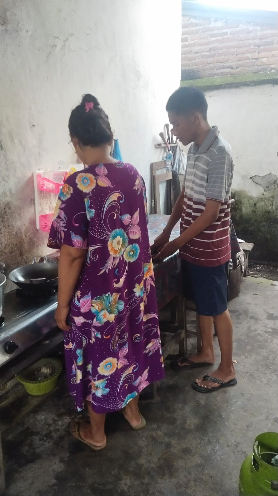
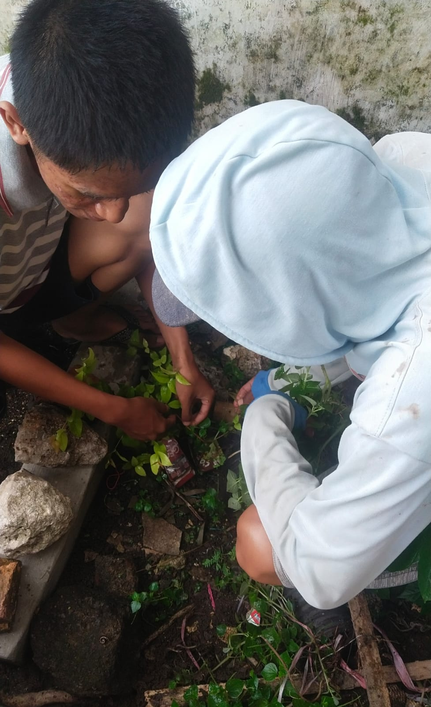

<!DOCTYPE html>
<html lang="id">
<head>
    <meta charset="UTF-8">
    <meta name="viewport" content="width=device-width, initial-scale=1.0">
    <title>Gotong Royong</title>
    
</!DOCTYPE html>
</head>
<body>
    

        

            <h2>Gotong Royong di Rumah</h2>
            
        

        

            <h2>Gotong Royong di Masyarakat</h2>
            
        

        

            <h2>Gotong Royong di Sekolah</h2>
            
        

    

</body>
</html
